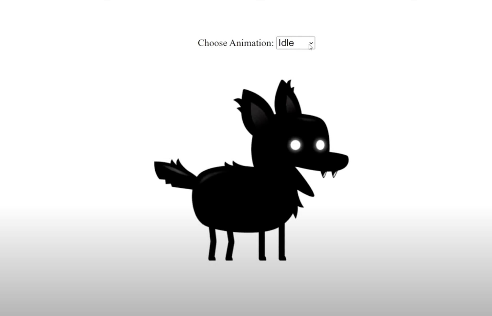

# Sprite Animation with HTML Canvas

A small web experiment using **HTML Canvas** and **vanilla JavaScript** to animate a character sprite with different states like idle, run, jump, etc.

---

##  What I Learned

- Drawing and clearing with `CanvasRenderingContext2D`
- How sprite sheets are structured and used
- Animating frame-by-frame using `drawImage()`
- Switching character states using a dropdown
- Controlling animation speed with `staggerFrames`

---

##  How It Works

- The sprite sheet has multiple **rows** for each animation state and **columns** for frames.
- Frame positions are calculated using the sprite's width, height, and state index.
- A dropdown lets you switch between animations like `run`, `jump`, `sit`, etc.
- Animation speed is managed using `gameFrame` and `requestAnimationFrame`.

---

##  Preview

## Credit

Based on a learning session from Franks Labrotary from youtube
