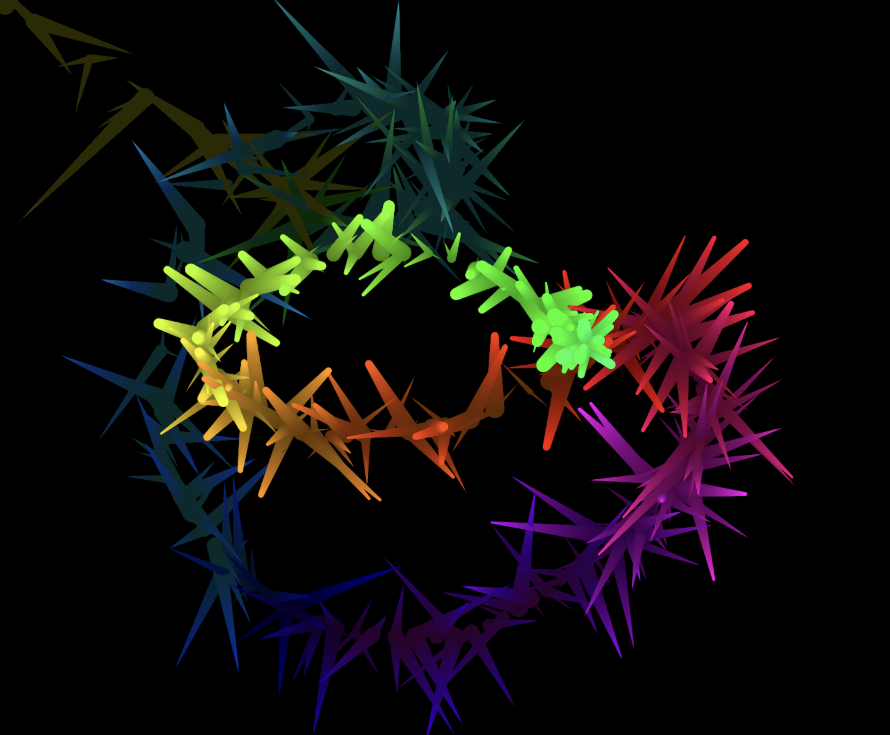

# Interactive Particle Trail with Vanilla JavaScript

This project creates an interactive particle animation using the HTML5 Canvas API and pure JavaScript. As you move or click your mouse, particles are generated with colorful trails that fade over time, producing a glowing effect.

## What I Learned

- How to work with the HTML Canvas API.
- Creating and animating particles using JavaScript classes.
- Using `HSL` color values to create color transitions.
- Handling mouse events (`click` and `mousemove`) for interaction.
- Creating trailing effects using transparent `fillRect` calls.
- Responsiveness: dynamically resizing the canvas with `window.innerWidth` and `window.innerHeight`.

## Features

- Particles appear where the user clicks or moves the mouse.
- Particles gradually shrink and fade away.
- Smooth color transitions using HSL values.
- Glowing trail effect through `rgba` background layering.
- Responsive canvas that adjusts to window size changes.

## Preview

## Credit

- Franks Labrotary
