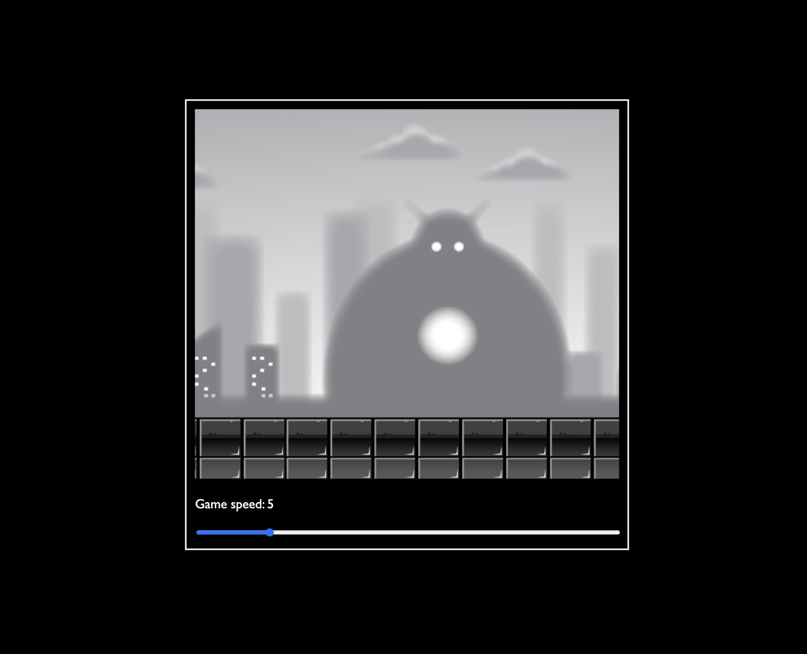

# Parallax Scrolling Background (JavaScript + Canvas)

A simple parallax background effect built using vanilla JavaScript and HTML Canvas. This was my first time implementing a layered background that moves at different speeds to create depth — a technique often used in side-scrolling games.

---

## What I Learned

- Basics of rendering multiple image layers using HTML `<canvas>`.
- Creating smooth parallax effects by moving background layers at variable speeds.
- Managing canvas redraws and animation loops.
- Adjusting scene speed dynamically using range input sliders.
- Understanding object-oriented animation structure with JavaScript classes.

---

## Features

- 5-layer parallax effect for natural depth
- Adjustable scroll speed via slider
- Optimized canvas rendering with looped background
- Lightweight and beginner-friendly

---

## Preview

## Credit

- Franks Labrotary
