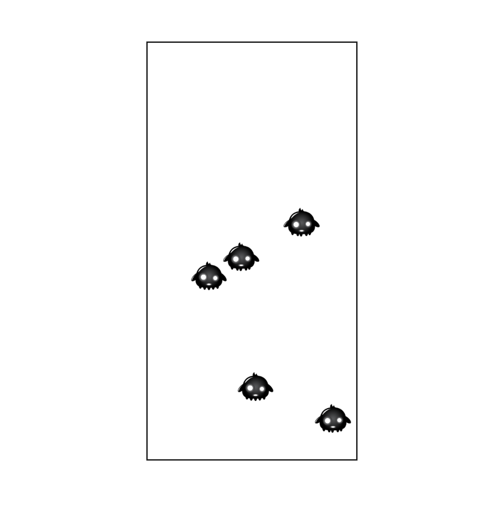

# Sinusoidal Enemy Movement (JavaScript + Canvas)

A smooth enemy movement animation built using vanilla JavaScript and HTML Canvas. This project was an experiment in animating sprites in a sinusoidal pattern — great practice for understanding trigonometry-based motion and game-style rendering.

---

## What I Learned

- Implementing sinusoidal (wave-like) motion using `Math.sin` and `Math.cos`.
- Creating reusable enemy objects with random speeds and behaviors.

---

## Features

- Randomized speed, position, and animation speed per enemy
- Sinusoidal pathing for natural, smooth motion
- Frame-based sprite animation for lifelike flapping
- Performance-optimized canvas redraw loop

---

## Preview

---

## Credit

- Based on tutorials by Franks Laboratory
